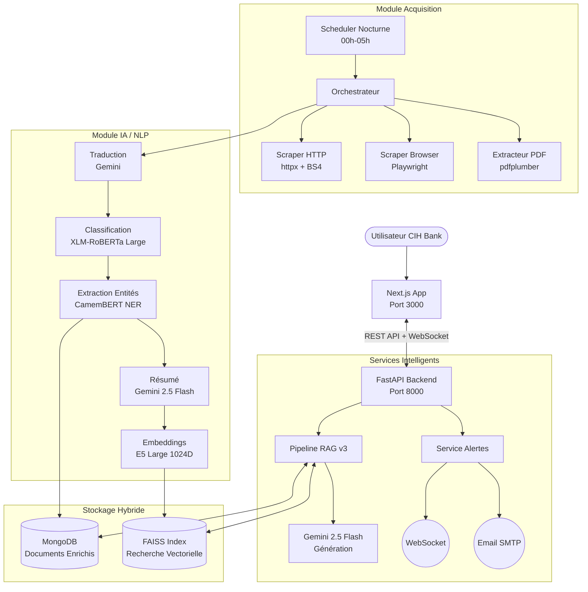
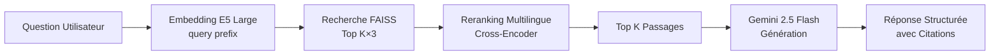
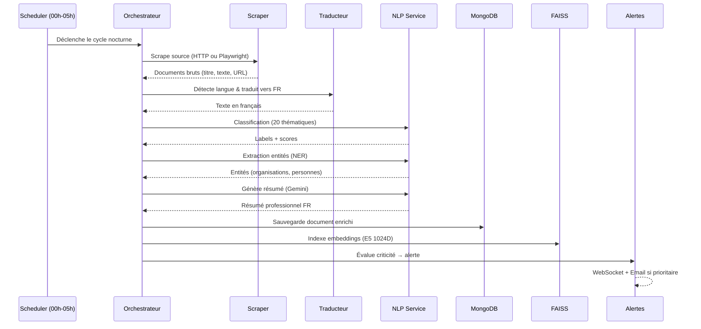

# 📘 CIH-Veille-IA — Documentation Technique Complète

> **Plateforme de Veille Réglementaire et Bancaire Intelligente pour CIH Bank**
> PFE 2025-2026 — EMSI Casablanca

---

## 📋 Table des Matières

1. [Présentation du Projet](#1-présentation-du-projet)
2. [Architecture Globale](#2-architecture-globale)
3. [Stack Technologique](#3-stack-technologique)
4. [Modèles IA & NLP](#4-modèles-ia--nlp)
5. [Structure du Projet](#5-structure-du-projet)
6. [Sources de Veille](#6-sources-de-veille)
7. [Flux de Données](#7-flux-de-données)
8. [API Backend — Endpoints](#8-api-backend--endpoints)
9. [Système d'Alertes](#9-système-dalertes)
10. [Sécurité & Conformité](#10-sécurité--conformité)
11. [Installation & Déploiement](#11-installation--déploiement)
12. [Configuration](#12-configuration)
13. [Scripts Utilitaires](#13-scripts-utilitaires)
14. [Choix Techniques & Design Patterns](#14-choix-techniques--design-patterns)

---

## 1. Présentation du Projet

**CIH-Veille-IA** est une plateforme de veille stratégique conçue pour **CIH Bank** (Maroc). Elle automatise la collecte, l'analyse et la diffusion d'informations réglementaires et bancaires grâce à l'IA.

### Objectifs
- **Automatiser la veille** : Scraping intelligent de 18+ sources institutionnelles et médias.
- **Enrichir par l'IA** : Classification thématique, extraction d'entités, résumé automatique.
- **Rechercher intelligemment** : Moteur RAG (Retrieval-Augmented Generation) avec chatbot IA.
- **Alerter en temps réel** : Notifications WebSocket + emails pour les documents critiques.
- **Traduire automatiquement** : Traduction FR/EN/AR via Gemini pour le contenu multilingue.

### Utilisateurs Cibles
| Rôle | Usage |
|---|---|
| **Direction Générale** | Tableau de bord KPI, veille stratégique |
| **Département Conformité** | Suivi circulaires BAM, réglementation |
| **Département Risques** | Alertes réglementaires, normes internationales |
| **Analystes** | Recherche sémantique, chatbot IA |

---

## 2. Architecture Globale



---

## 3. Stack Technologique

| Couche | Technologies | Version | Rôle |
|---|---|---|---|
| **Backend** | Python, FastAPI, Uvicorn | 3.10+, 0.100+ | API REST asynchrone, WebSocket |
| **Frontend** | Next.js, React, TailwindCSS, Shadcn UI | 14+ | Interface utilisateur moderne |
| **Base de données** | MongoDB (Motor async) | 7.0+ | Documents enrichis, utilisateurs, alertes |
| **Recherche vectorielle** | FAISS, sentence-transformers | - | Similarité sémantique 1024 dimensions |
| **IA / NLP** | Transformers, spaCy, Google Gemini | - | Classification, NER, Résumé, RAG |
| **Scraping** | Playwright, httpx, BeautifulSoup4 | - | Extraction web dynamique et statique |
| **PDF** | pdfplumber | - | Extraction texte depuis PDF |
| **Sécurité** | JWT, bcrypt, CORS, Rate Limiting | - | Authentification et contrôle d'accès |
| **DevOps** | Docker, Docker Compose, Nginx | - | Conteneurisation et reverse proxy |

---

## 4. Modèles IA & NLP

### 4.1 Modèles Utilisés

| Tâche | Modèle | Source | Dimensions / Détails |
|---|---|---|---|
| **Classification** | `joeddav/xlm-roberta-large-xnli` | Hugging Face | Zero-shot multilingue (FR, EN, AR) |
| **NER** | `Jean-Baptiste/camembert-ner` | Hugging Face | Meilleur NER français |
| **Résumé** | Google Gemini 2.5 Flash | Google AI | Résumés professionnels FR via API |
| **Embeddings** | `intfloat/multilingual-e5-large` | Hugging Face | 1024 dimensions, multilingue |
| **Reranking** | `cross-encoder/ms-marco-multilingual-MiniLM-L-6-v2` | Hugging Face | Cross-encoder multilingue |
| **Chunking** | `fr_core_news_md` | spaCy | Découpage sémantique français |
| **LLM (RAG)** | Google Gemini 2.5 Flash | Google AI | Génération de réponses RAG |
| **Traduction** | Google Gemini 2.0 Flash | Google AI | FR ↔ EN ↔ AR |

### 4.2 Thématiques de Classification (20 topics)

| # | Thématique |
|---|---|
| 1 | Réglementation bancaire |
| 2 | Lutte contre le blanchiment (LCB-FT) |
| 3 | Risque de crédit |
| 4 | Risque opérationnel |
| 5 | Risque de marché |
| 6 | Cybersécurité |
| 7 | Protection des données personnelles |
| 8 | Paiements et moyens de paiement |
| 9 | Banque de détail |
| 10 | Banque de financement et d'investissement |
| 11 | Innovation et fintech |
| 12 | Intelligence artificielle en banque |
| 13 | Durabilité et finance verte |
| 14 | Inclusion financière |
| 15 | Politique monétaire |
| 16 | Taux d'intérêt et marché obligataire |
| 17 | Immobilier et crédit hypothécaire |
| 18 | Transformation digitale |
| 19 | Gouvernance d'entreprise |
| 20 | Conformité et contrôle interne |

### 4.3 Pipeline RAG v3



---

## 5. Structure du Projet

```
cih-veille-ia/
├── app/                                    # Cœur de l'application
│   ├── backend/                            # API FastAPI
│   │   ├── api.py                          # Endpoints REST + WebSocket
│   │   ├── auth.py                         # Authentification JWT
│   │   └── schemas.py                      # Modèles Pydantic (validation)
│   │
│   ├── scraping/                           # Module d'acquisition
│   │   ├── orchestrator.py                 # Chef d'orchestre (enrichissement IA)
│   │   ├── scheduler.py                    # Planificateur nocturne (00h-05h)
│   │   ├── institutional_scraper.py        # Scraper HTTP (sites statiques)
│   │   ├── browser_scraper.py              # Scraper Playwright (sites JS)
│   │   ├── pdf_service.py                  # Extraction PDF
│   │   └── sources_registry.py             # Registre des 18 sources
│   │
│   ├── nlp/                                # Intelligence Artificielle
│   │   ├── banking_nlp.py                  # Classification + NER + Résumé
│   │   ├── llm_service.py                  # Service LLM multi-provider
│   │   ├── embeddings.py                   # Embeddings E5 Large (1024D)
│   │   ├── reranking.py                    # Cross-Encoder multilingue
│   │   ├── cleaning.py                     # Nettoyage et normalisation
│   │   └── translation_service.py          # Traduction FR/EN/AR (Gemini)
│   │
│   ├── rag/                                # Moteur RAG & Chatbot
│   │   ├── pipeline.py                     # Pipeline RAG v3 complet
│   │   ├── chunking.py                     # Découpage sémantique (spaCy)
│   │   ├── vector_store.py                 # Index FAISS (persistance)
│   │   └── chatbot.py                      # Logique conversationnelle
│   │
│   ├── storage/                            # Persistence des données
│   │   ├── mongo_store.py                  # CRUD MongoDB (async)
│   │   ├── rag_storage.py                  # Stockage hybride Mongo+FAISS
│   │   └── audit_log.py                    # Logs d'audit immuables
│   │
│   ├── alerts/                             # Système de notification
│   │   ├── alerts_service.py               # Logique d'alerte (priorité)
│   │   └── outlook_connector.py            # Microsoft Graph API
│   │
│   ├── notifications/                      # Service email SMTP
│   │   └── service.py                      # Envoi d'emails (fire-and-forget)
│   │
│   ├── search/                             # Moteur de recherche
│   │   └── semantic_search.py              # Recherche hybride (vecteurs + texte)
│   │
│   ├── config/                             # Configuration
│   │   ├── settings.py                     # Variables d'environnement
│   │   ├── security.py                     # Whitelist domaines, rate limiting
│   │   └── logging_config.py               # Configuration des logs
│   │
│   └── banking-intelligence-platform/      # Frontend Next.js
│       ├── app/                            # Pages (App Router)
│       │   ├── dashboard/                  # Tableau de bord principal
│       │   ├── search/                     # Recherche sémantique
│       │   ├── documents/                  # Liste des documents
│       │   ├── alerts/                     # Alertes et monitoring
│       │   ├── sources/                    # Gestion des sources
│       │   ├── admin/                      # Administration
│       │   └── ai-chat/                    # Chatbot IA (RAG)
│       ├── components/                     # Composants UI (Shadcn)
│       └── lib/api.ts                      # Client API TypeScript
│
├── nginx/                                  # Configuration Nginx
├── scripts/                                # Scripts utilitaires
├── tests/                                  # Tests unitaires
├── vector_store/                           # Index FAISS persisté
├── docker-compose.yml                      # Docker Compose (dev)
├── docker-compose.prod.yml                 # Docker Compose (production)
├── Dockerfile                              # Image Docker backend
├── requirements.txt                        # Dépendances Python
└── .env                                    # Variables d'environnement
```

---

## 6. Sources de Veille

### 6.1 Régulateurs & Institutions Officielles (Maroc)

| Source | URL | Type |
|---|---|---|
| **Bank Al-Maghrib — Communiqués** | bkam.ma | Communiqué |
| **Bank Al-Maghrib — Circulaires** | bkam.ma (Supervision) | Circulaire |
| **AMMC** | ammc.ma | Communiqué |
| **Ministère de l'Économie** | finances.gov.ma | News |
| **CNDP** | cndp.ma | News |
| **SGG** | sgg.gov.ma | News |

### 6.2 Réglementation Internationale

| Source | URL | Type |
|---|---|---|
| **BIS** (Bank for International Settlements) | bis.org | Press Release |
| **FMI** (Fonds Monétaire International) | imf.org | News |
| **Banque Mondiale** | worldbank.org | News |
| **EBA** (European Banking Authority) | eba.europa.eu | News |

### 6.3 Presse Économique & Financière

| Source | URL | Type |
|---|---|---|
| **L'Economiste** | leconomiste.com | Articles |
| **Medias24** | medias24.com | Articles |
| **Challenge.ma** | challenge.ma | Articles |
| **Reuters Finance** | reuters.com | News |

### 6.4 Secteur Bancaire Maroc

| Source | URL | Type |
|---|---|---|
| **CIH Bank** | cihbank.ma | Communiqué |
| **GPBM** | gpbm.ma | News |
| **Bourse de Casablanca** | casablanca-bourse.com | Market News |
| **ACAPS** | acaps.ma | News |

---

## 7. Flux de Données

### 7.1 Pipeline d'Acquisition (ETL + IA)



### 7.2 Pipeline RAG (Recherche & Chatbot)

1. **Question** : L'utilisateur pose une question via le chatbot.
2. **Embedding** : La question est encodée avec le prefix `query:` (E5 Large).
3. **Recherche Dense** : FAISS retourne les top K×3 passages les plus similaires.
4. **Reranking** : Un Cross-Encoder multilingue réévalue la pertinence de chaque passage.
5. **Génération** : Gemini 2.5 Flash synthétise une réponse structurée avec citations.
6. **Réponse** : L'utilisateur reçoit la réponse avec les sources citées.

### 7.3 Scheduler Nocturne

Le scraping est automatiquement planifié entre **00h00 et 05h00** (heure du Maroc) pour :
- Ne pas impacter les performances pendant les heures de travail
- Profiter de la bande passante libre la nuit
- Permettre le scraping manuel via `POST /scrape-all` en journée si nécessaire

---

## 8. API Backend — Endpoints

### 8.1 Authentification

| Méthode | Endpoint | Description |
|---|---|---|
| `POST` | `/token` | Connexion (retourne JWT) |
| `GET` | `/users/me` | Profil utilisateur courant |

### 8.2 Documents

| Méthode | Endpoint | Description |
|---|---|---|
| `GET` | `/documents` | Liste paginée des documents enrichis |
| `GET` | `/documents/{id}` | Détail d'un document |
| `DELETE` | `/documents/{id}` | Suppression d'un document |

### 8.3 Sources

| Méthode | Endpoint | Description |
|---|---|---|
| `GET` | `/sources` | Liste des sources de veille |
| `POST` | `/sources` | Ajouter une source |
| `DELETE` | `/sources/{id}` | Supprimer une source |

### 8.4 Scraping

| Méthode | Endpoint | Description |
|---|---|---|
| `POST` | `/scrape/{source_id}` | Scraping manuel d'une source |
| `POST` | `/scrape-all` | Lancer un cycle complet de scraping |

### 8.5 Recherche & RAG

| Méthode | Endpoint | Description |
|---|---|---|
| `GET` | `/search?q=...` | Recherche hybride (sémantique + texte) |
| `POST` | `/rag/ask` | Poser une question au chatbot IA |

### 8.6 Alertes

| Méthode | Endpoint | Description |
|---|---|---|
| `GET` | `/alerts/latest` | Dernières alertes |
| `GET` | `/alerts/unread-count` | Nombre d'alertes non lues |
| `POST` | `/alerts/{id}/read` | Marquer une alerte comme lue |

### 8.7 Analytics

| Méthode | Endpoint | Description |
|---|---|---|
| `GET` | `/analytics/kpis` | KPIs principaux (docs, sources, alertes) |
| `GET` | `/analytics/dashboard` | Données du tableau de bord |

### 8.8 WebSocket

| Endpoint | Description |
|---|---|
| `ws://localhost:8000/ws/notifications/{username}` | Notifications temps réel |

---

## 9. Système d'Alertes

### 9.1 Niveaux de Priorité

| Priorité | Critères | Action |
|---|---|---|
| **🔴 Critique** | Circulaire BAM, réglementation obligatoire | Email immédiat + WebSocket |
| **🟡 Important** | Nouvelle réglementation, risque élevé | WebSocket + stockage |
| **🟢 Informatif** | Presse, analyse de marché | Stockage uniquement |

### 9.2 Canaux de Notification

- **WebSocket** : Notification en temps réel dans l'interface Next.js
- **Email SMTP** : Via Outlook (SMTP Office365) — envoi non-bloquant (fire-and-forget)
- **Microsoft Graph API** : Alternative pour les emails via Azure AD (optionnel)

---

## 10. Sécurité & Conformité

### 10.1 Authentification & Autorisation
- **JWT** : Tokens signés HS256 avec expiration configurable
- **Hachage** : Mots de passe hashés avec bcrypt (passlib)
- **RBAC** : Contrôle basé sur les rôles (Admin, Analyste, Viewer)

### 10.2 Protection API
- **CORS** : Origins autorisées configurables
- **Rate Limiting** : 60 requêtes/minute par défaut (SlowAPI)
- **Validation** : Pydantic pour toutes les entrées/sorties

### 10.3 Sécurité des Données
- **Whitelist Domaines** : Seuls les domaines du registre de sources sont scrappés
- **Sanitization** : Nettoyage des données scrappées contre XSS/injection
- **Audit Logs** : Journalisation immuable de toutes les actions critiques

---

## 11. Installation & Déploiement

### 11.1 Prérequis

| Logiciel | Version | Usage |
|---|---|---|
| Python | 3.10+ | Backend et IA |
| Node.js | 18+ | Frontend Next.js |
| MongoDB | 7.0+ | Base de données |
| Git | 2.40+ | Gestion de version |

### 11.2 Installation Locale

#### Backend
```bash
# 1. Cloner le projet
git clone https://github.com/iliassnacer5/CihVeilleIA.git
cd CihVeilleIA

# 2. Créer l'environnement virtuel
python -m venv .venv
.venv\Scripts\activate         # Windows
# source .venv/bin/activate    # Linux/Mac

# 3. Installer les dépendances
pip install -r requirements.txt

# 4. Télécharger le modèle spaCy
python -m spacy download fr_core_news_md

# 5. Installer Playwright (pour le scraping browser)
playwright install chromium

# 6. Configurer l'environnement
copy .env.example .env
# Éditer .env avec vos clés API (Gemini, MongoDB, etc.)

# 7. Initialiser la base de données
python init_db.py

# 8. Lancer le backend
uvicorn app.backend.api:app --port 8000 --host 0.0.0.0 --reload
```

#### Frontend
```bash
# 1. Aller dans le dossier frontend
cd app/banking-intelligence-platform

# 2. Installer les dépendances
npm install

# 3. Lancer le serveur de développement
npm run dev
```

### 11.3 Déploiement Docker (Production)

```bash
# Lancer tous les services
docker-compose -f docker-compose.prod.yml up -d

# Services déployés :
# - Backend FastAPI : port 8000
# - Frontend Next.js : port 3000
# - MongoDB : port 27017
# - Nginx (reverse proxy) : port 80
```

---

## 12. Configuration

### 12.1 Variables d'Environnement (`.env`)

```bash
# --- Environnement ---
ENV=local                                   # local | production
DEBUG=true

# --- Sécurité API ---
API_SECRET_KEY=votre-clé-secrète-ici        # OBLIGATOIRE en production
ALGORITHM=HS256
ACCESS_TOKEN_EXPIRE_MINUTES=60

# --- MongoDB ---
MONGODB_URI=mongodb://localhost:27017
MONGODB_DB_NAME=VeillePlus
MONGODB_COLLECTION_ENRICHED=enriched_documents

# --- CORS ---
ALLOWED_ORIGINS=["http://localhost:3000","http://localhost:8000"]

# --- Google Gemini (RECOMMANDÉ pour le RAG) ---
GEMINI_API_KEY=votre-clé-api-gemini

# --- OpenAI (Alternatif) ---
# OPENAI_API_KEY=votre-clé-api-openai
# OPENAI_MODEL=gpt-4o-mini

# --- SMTP (Emails) ---
SMTP_HOST=smtp.office365.com
SMTP_PORT=587
SMTP_USER=votre-email@outlook.com
SMTP_PASSWORD=votre-app-password

# --- Azure AD (Optionnel — Microsoft Graph) ---
# AZURE_CLIENT_ID=...
# AZURE_CLIENT_SECRET=...
# AZURE_TENANT_ID=...

# --- Rate Limiting ---
RATE_LIMIT_PER_MINUTE=60

# --- Redis (Optionnel — Cache) ---
# REDIS_URL=redis://localhost:6379/0
```

---

## 13. Scripts Utilitaires

| Script | Commande | Description |
|---|---|---|
| `init_db.py` | `python init_db.py` | Initialise MongoDB et crée l'utilisateur admin |
| `run_api.py` | `python run_api.py` | Lance le backend FastAPI |
| `run_full_scraping.py` | `python run_full_scraping.py` | Lance un cycle complet de scraping |
| `run_dashboard.py` | `python run_dashboard.py` | Lance le dashboard Streamlit |
| `sync_sources_db.py` | `python sync_sources_db.py` | Synchronise le registre de sources avec MongoDB |
| `clear_sources_db.py` | `python clear_sources_db.py` | Vide la collection de sources |
| `test_gemini.py` | `python test_gemini.py` | Teste la connexion API Gemini |

---

## 14. Choix Techniques & Design Patterns

### 14.1 Asynchronisme & Performance
- **AsyncIO** : Toutes les opérations I/O (scraping, MongoDB, API) sont asynchrones via `asyncio`
- **Motor** : Driver MongoDB asynchrone pour des requêtes non-bloquantes
- **`asyncio.to_thread`** : Les opérations CPU-bound (NLP, embeddings) sont déléguées à des threads
- **Fire-and-Forget** : Les notifications email sont envoyées via `asyncio.create_task` sans bloquer

### 14.2 Architecture RAG Hybride
- **Dense Retrieval** : FAISS avec embeddings E5 Large (1024D) pour la recherche sémantique
- **Cross-Encoder Reranking** : Ré-ordonnancement multilingue pour maximiser la pertinence
- **E5 Prefixing** : Les requêtes utilisent le prefix `query:`, les passages utilisent `passage:`
- **LLM Generation** : Gemini 2.5 Flash avec system prompt optimisé pour le banking

### 14.3 Modularité & Design Patterns
- **Factory Pattern** : Instanciation du bon type de scraper selon la config source
- **Lazy Loading** : Les modèles NLP sont chargés à la demande (réduit le temps de démarrage)
- **Singleton** : Connexions MongoDB et modèles IA partagés pour économiser la RAM
- **Dependency Injection** : Via FastAPI `Depends()` pour le découplage et la testabilité
- **Fallback Pattern** : Chaque composant IA a un fallback (Gemini 2.5 → 2.0, LLM → local)

### 14.4 Sécurité
- **Audit Trail** : Chaque action critique est logguée dans une collection MongoDB immuable
- **Domain Whitelist** : Générée automatiquement depuis `sources_registry.py`
- **Input Sanitization** : Nettoyage des données scrappées et des entrées utilisateur
- **RBAC** : Contrôle d'accès basé sur les rôles via middleware JWT

### 14.5 Robustesse du Scraping
- **Timeout global** : 120 secondes max par source pour éviter les blocages
- **Night-Only** : Le scraping automatique ne tourne qu'entre 00h et 05h (Morocco time)
- **Retry & Fallback** : Gestion des erreurs SSL, timeout, et pages vides
- **Duplicate Detection** : Vérification par URL pour éviter les doublons en base

---

## 📄 Licence

Projet PFE — EMSI Casablanca 2025-2026
Développé pour **CIH Bank** dans le cadre d'un projet de fin d'études.

---

> **Dernière mise à jour** : 14 Février 2026
