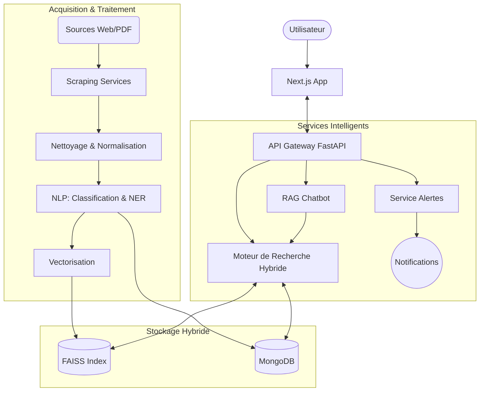

# 📘 Documentation Technique - Projet CIH-Veille-IA

Ce document présente une analyse technique détaillée, l'architecture, et le fonctionnement de la plateforme de veille intelligente **CIH-Veille-IA**.

---

## 🏗️ 1. Architecture Globale & Technologies

### 1.1 Vue d'Ensemble
La plateforme est conçue comme un système modulaire de veille stratégique bancaire intégrant :
- **Backend API (FastAPI)** : Gère la logique métier, l'authentification, les websockets et l'exposition des données.
- **Micro-services IA (Interne)** : 
  - **Scraping** : Collecte intelligente (Institutional + Browser based).
  - **NLP** : Traitement du langage naturel (Classification, NER, Résumé).
  - **RAG (Retrieval Augmented Generation)** : Moteur de recherche sémantique et Chatbot.
- **Stockage Hybride** : MongoDB (Données structurées & Méta-données) + FAISS (Index vectoriel pour la recherche sémantique).
- **Frontend** :
  - **Application Bancaire (Next.js)** : Interface utilisateur moderne pour la consultation et la recherche.
  - **Dashboard Admin (Streamlit)** : Outil de monitoring, KPIs et configuration rapide.



### 1.2 Stack Technologique
| Couche | Technologies | Rôle |
| :--- | :--- | :--- |
| **Backend** | Python 3.10+, FastAPI, Uvicorn | API REST performante et asynchrone, WebSockets. |
| **IA / NLP** | PyTorch, Hugging Face Transformers, spaCy | Embeddings, Classification Zero-Shot, NER, Résumé abstractif. |
| **Scraping** | Playwright, httpx, BeautifulSoup4, pdfplumber | Extraction robuste (sites dynamiques JS, PDF, HTML statique). |
| **Database** | MongoDB (Motor async driver) | Stockage flexible des documents enrichis, logs d'audit, utilisateurs. |
| **Vector Search** | FAISS, sentence-transformers | Recherche par similarité sémantique haute performance. |
| **Reranking** | Cross-Encoder (MS MARCO) | Amélioration de la pertinence des résultats de recherche. |
| **Frontend App** | Next.js 14, React, TailwindCSS, Shadcn UI | Interface utilisateur réactive et esthétique. |
| **Dashboard** | Streamlit, Plotly | Visualisation rapide des données et administration. |
| **DevOps** | Docker, Docker Compose | Conteneurisation et orchestration locale. |
| **Alerting** | Microsoft Graph API (Outlook), WebSockets | Notifications temps réel et emails. |

---

## 📂 2. Structure du Projet & Rôle des Dossiers

Le projet suit une **architecture hexagonale simplifiée** (Ports & Adapters) où la logique métier est découplée des interfaces (API, CLI, UI).

### `app/` (Cœur de l'application)

#### `app/backend/` - Interface API
Contient la logique d'exposition des services via HTTP et WebSocket.
- **Rôle** : Point d'entrée pour le frontend Next.js et gestion des requêtes clients.
- **Fichiers clés** :
  - `api.py` : Définition des endpoints REST, gestion du cycle de vie (startup/shutdown), injection de dépendances.
  - `auth.py` : Gestion de l'authentification JWT (création de tokens, vérification, hachage de mots de passe).
  - `schemas.py` : Modèles Pydantic pour la validation stricte des données (Request/Response).

#### `app/scraping/` - Module d'Acquisition
Responsable de la collecte de données depuis des sources externes.
- **Rôle** : Explorer le web, contourner les protections, extraire le contenu utile.
- **Fichiers clés** :
  - `orchestrator.py` : Chef d'orchestre asynchrone qui gère les files d'attente de scraping et l'appel aux modèles IA.
  - `institutional_scraper.py` : Scraper pour sites institutionnels standards (requêtes HTTP simples).
  - `browser_scraper.py` : Scraper utilisant un navigateur réel (Playwright) pour les sites complexes (JS, SPA).
  - `pdf_service.py` : Extraction de texte depuis des fichiers PDF (Rapports, Circulaires).
  - `sources_registry.py` : Configuration centralisée des sources (URLs, sélecteurs CSS, type de scraper).

#### `app/nlp/` - Intelligence Artificielle (Traitement)
Contient toute la logique de traitement linguistique.
- **Rôle** : Nettoyer, comprendre et enrichir les données brutes.
- **Fichiers clés** :
  - `banking_nlp.py` : Service principal intégrant les pipelines Transformers (Classification, NER, Résumé).
  - `cleaning.py` : Nettoyage du texte, détection de langue, normalisation des dates.
  - `embeddings.py` : Conversion de texte en vecteurs (Semantic Embeddings).
  - `reranking.py` : Ré-ordonnancement des résultats de recherche pour améliorer la précision.

#### `app/rag/` - Moteur RAG & Chatbot
Implémente la logique de "Retrieval Augmented Generation".
- **Rôle** : Permettre au système de répondre à des questions en utilisant sa propre base de connaissance.
- **Fichiers clés** :
  - `pipeline.py` : Pipeline complet : Indexation (Chunking -> Embedding -> FAISS) et Récupération (Query -> Search -> Rerank).
  - `chatbot.py` : Logique conversationnelle, gestion du contexte et citation des sources.
  - `chunking.py` : Découpage intelligent des textes pour l'indexation vectorielle (via spaCy).
  - `vector_store.py` : Abstraction de l'index FAISS (ajout, recherche, persistance).

#### `app/storage/` - Persistence des Données
Couche d'accès aux données (DAO / Repository pattern).
- **Rôle** : Abstraire les interactions avec la base de données (MongoDB) et les logs.
- **Fichiers clés** :
  - `mongo_store.py` : Gestionnaires CRUD asynchrones pour Documents, Sources, Utilisateurs, Alertes.
  - `rag_storage.py` : Service hybride gérant à la fois le stockage Mongo (contenu) et FAISS (vecteurs).
  - `audit_log.py` : Système de journalisation d'audit immuable pour la conformité.

#### `app/alerts/` - Système de Notification
Gère la diffusion de l'information.
- **Rôle** : Informer les utilisateurs des nouvelles données pertinentes.
- **Fichiers clés** :
  - `alerts_service.py` : Logique métier pour décider quand et qui alerter (règles de priorité).
  - `outlook_connector.py` : Intégration avec Microsoft Graph pour l'envoi d'emails professionnels.

#### `app/search/` - Moteur de Recherche
Logique unifiée de recherche.
- **Fichiers clés** :
  - `semantic_search.py` : Moteur combinant recherche vectorielle (sens) et recherche par mots-clés (précision). Implémente la "Recherche Hybride".

#### `app/config/` - Configuration
- **Fichiers clés** :
  - `settings.py` : Variables d'environnement, constantes globales.
  - `security.py` : Paramètres de sécurité (whitelist domaines, rate limiting).
  - `logging_config.py` : Configuration centralisée des logs applicatifs.

#### `app/dashboard/` - Frontend Admin (Legacy/Internal)
Application Streamlit pour l'administration rapide.
- **Rôle** : Visualisation des KPIs, debug des listings, test manuel du scraping.

#### `app/banking-intelligence-platform/` - Frontend Utilisateur (Production)
Application Next.js complète.
- **Structure** :
  - `app/` : Pages de l'application (Router App).
  - `components/` : Composants UI réutilisables (basés sur Shadcn UI).
  - `lib/api.ts` : Client API pour communiquer avec le backend FastAPI.

---

## 🌊 3. Flux de Données (Data Flow)

### 3.1 Pipeline d'Acquisition (ETL + AI)
1.  **Trigger** : Lancement manuel ou planifié (`run_full_scraping.py` ou API).
2.  **Scraping** : L'orchestrateur délègue à `InstitutionalScraper` ou `BrowserScraper` selon la source.
3.  **Extraction** : Le HTML ou PDF est converti en texte brut (`RawTextDocument`).
4.  **Nettoyage** : `TextCleaner` retire le bruit, normalise les dates, détecte la langue.
5.  **Enrichissement IA** :
    - Classification Zero-Shot (Thématique bancaire).
    - NER (Extraction Entités : Organismes, Personnes).
    - Résumé (Abstractif via Transformers).
6.  **Stockage** :
    - Document enrichi -> MongoDB (`enriched_documents`).
    - Vecteurs (Embeddings) & Metadata -> FAISS Index (`vector_store/`).
7.  **Alerting** : Si le document est prioritaire -> Notification WebSocket + Email Outlook.

### 3.2 Flux de Recherche (RAG Hybrid)
1.  **Utilisateur** : Pose une question via l'interface Next.js.
2.  **Moteur de Recherche** :
    - **Branche Vectorielle** : `Question` -> Embedding -> Recherche FAISS (Top K).
    - **Branche Lexicale** : `Question` -> Recherche Texte MongoDB (Top K).
3.  **Fusion & Reranking** : Les résultats sont fusionnés, puis un Cross-Encoder réévalue la pertinence de chaque passage par rapport à la question.
4.  **Réponse** :
    - **Mode Recherche** : Retourne la liste des documents triés.
    - **Mode Chat** : Le contexte (passages) est envoyé à un modèle de génération pour synthétiser une réponse en langage naturel.

---

## 🛠️ 4. Choix Techniques & Bonnes Pratiques

### 4.1 Asynchronisme & Performance
Pour gérer le scraping massif et les requêtes concurrentes, le projet utilise intensivement `asyncio` (Python) et `AsyncIOMotorClient` (MongoDB). Cela permet de ne pas bloquer le thread principal pendant les I/O réseau ou disque.
- *Justification* : Python est mono-threadé par défaut ; l'async est crucial pour la scalabilité d'un crawler.

### 4.2 Architecture RAG Hybride
Le choix d'implémenter une recherche hybride (Vecteurs + Mots-clés) avec une étape de **Reranking** est un standard de l'industrie pour augmenter la précision (Precision @k).
- *Justification* : La recherche vectorielle comprend le sens mais peut manquer des termes exacts (ex: acronymes bancaires spécifiques). La recherche par mots-clés compense cela.

### 4.3 Modularité & Design Patterns
- **Factory Pattern** : Utilisé dans les scrapers pour instancier le bon type de scraper selon la config.
- **Singleton** : Utilisé pour les connexions lourdes (DB, Modèles IA) afin d'économiser la RAM.
- **Dependency Injection** : Utilisé dans FastAPI (`Depends`) pour faciliter les tests et le découplage.

### 4.4 Sécurité & Conformité
- **Audit Logs** : Chaque action critique (scraping, alerte, login) est logguée dans une collection immuable (`audit_trail`).
- **Sanitization** : Nettoyage des entrées utilisateurs et des données scrappées pour éviter les injections XSS/NoSQL.
- **Contrôle d'accès** : RBAC simplifié (Admin vs Analyste) via JWT.

### 4.5 Robustesse du Scraping
L'utilisation combinée de `httpx` (rapide) et `Playwright` (puissant) permet de couvrir 99% des cas d'usage web.
Le scraper gère les retries, le respect du `robots.txt` (via `time.sleep` et User-Agent), et les erreurs SSL/Timeout.

---

## 🚀 5. Guide de Démarrage Rapide

### Prérequis
- Python 3.10+
- Node.js 18+
- MongoDB (local ou distant)

### Installation
1.  **Backend** :
    ```bash
    pip install -r requirements.txt
    python -m spacy download fr_core_news_md
    uvicorn run_api:app --reload
    ```
2.  **Frontend** :
    ```bash
    cd app/banking-intelligence-platform
    npm install
    npm run dev
    ```

### Scripts Utiles
- `python run_full_scraping.py` : Lance une campagne de collecte sur toutes les sources.
- `python init_db.py` : Initialise la base de données et crée le premier utilisateur admin.
- `python run_dashboard.py` : Lance le dashboard Streamlit d'administration.
